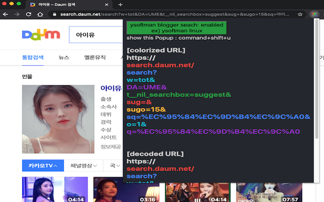
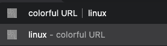

# Colorful URL (chrome extension)

## 설치

- chrome://extensions/ -> 개발자 모드 활성화 -> 압축해제된 확장 프로그램을 로드합니다.(LOAD UNPACKED) -> 프로젝트 디렉토리 선택

## 디버깅

- 코드 수정 후 chrome://extensions/ 에서 '업데이트' 하면 바로 적용된다.
- 앱의 '백그라운드 페이지' 에서 콘솔 로그를 확인한다.

## 기능

- 현재 URL을 컬러로 구분해 보여준다.
  
- 주소표시줄(omni box)에서 ysoftman + 공백 + 키워드를 쓰면 내 블로그에서 검색한다. ex) ysoftman linux
  

## references

- <https://developer.chrome.com/extensions/getstarted>
- <https://developer.chrome.com/extensions/devguide>
- <https://developer.chrome.com/extensions/omnibox>
